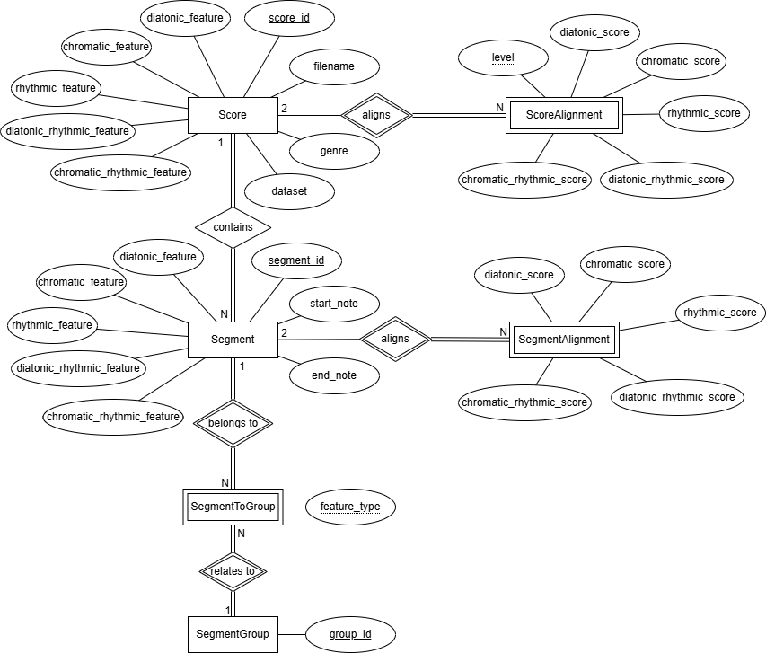

# Phylo-Analysis of Folk Traditions

This repository provides a novel methodology for the hierarchical analysis of musical similarity, specifically designed for symbolic folk music collections. Our approach leverages phylogenetic analysis to uncover relationships between different musical genres and traditions. The tools included allow for feature extraction, phrase clustering, multiple forms of similarity calculation, and visualization of results as phylogenetic trees and heatmaps.

## Table of Contents

- [Phylo-Analysis of Folk Traditions](#phylo-analysis-of-folk-traditions)
  - [Table of Contents](#table-of-contents)
  - [Methodology Overview](#methodology-overview)
  - [Key Features](#key-features)
    - [Feature Types](#feature-types)
    - [Scores \& Phrases Processing](#scores--phrases-processing)
    - [Phrases Clustering](#phrases-clustering)
    - [Compute similarities](#compute-similarities)
    - [Code Implementation Notes](#code-implementation-notes)
  - [Annotated Galician - Irish Dataset](#annotated-galician---irish-dataset)
  - [Download and Setup](#download-and-setup)
    - [Previous Requirements](#previous-requirements)
    - [Setup](#setup)
  - [Running General Execution](#running-general-execution)
  - [Additional Analysis Examples](#additional-analysis-examples)
    - [Individual Tree Generation](#individual-tree-generation)
    - [Genre Distance Analysis](#genre-distance-analysis)
    - [Heatmap Comparison](#heatmap-comparison)
    - [GSR (Genre Separation Ratio) Analysis](#gsr-genre-separation-ratio-analysis)
      - [Sensitivity Analysis](#sensitivity-analysis)
      - [Random Baseline Analysis](#random-baseline-analysis)
      - [Combined GSR Analysis](#combined-gsr-analysis)
  - [Advanced Usage Examples](#advanced-usage-examples)
    - [Phylogenetic Tree Visualization](#phylogenetic-tree-visualization)
    - [Custom Genre Groups Analysis](#custom-genre-groups-analysis)
    - [Matrix Correlation Analysis](#matrix-correlation-analysis)
  - [Results Database](#results-database)
    - [Database Queries Examples](#database-queries-examples)
  - [Glossary](#glossary)
  - [Troubleshooting](#troubleshooting)
    - [Common Issues](#common-issues)
    - [Performance Tips](#performance-tips)
  - [Citation](#citation)

## Methodology Overview

Our methodology, illustrated below, is a multi-step process:
1.  **Feature Extraction**: Melodic and rhythmic features (chromatic intervals, diatonic intervals, and rhythmic ratios) are extracted from musical scores.
2.  **Phrase Clustering**: The extracted musical phrases are grouped into clusters based on their similarity using a global alignment and QT Clustering.
3.  **Similarity Calculation**: We compute four types of similarity between scores:
    *   **Global Similarity**: A direct comparison of the entire musical score's features.
    *   **Shared Phrases Similarity**: Measures the proportion of shared phrase clusters between scores.
    *   **Form Similarity**: Compares the structural arrangement of phrase clusters within scores.
    *   **Combined Similarity**: A weighted combination of Form and Shared Phrases similarities.
4.  **Phylogenetic Analysis**: For each similarity method, a distance matrix is generated and used to construct a phylogenetic tree, visualizing the relationships between scores and genres.


## Key Features

### Feature Types

The methodology extracts and analyzes different types of musical features:

- **Diatonic** (D): Diatonic interval sequences representing melodic patterns within the key.
- **Chromatic** (C): Chromatic interval sequences capturing all semitone relationships.
- **Rhythmic** (R): Rhythmic ratio patterns representing temporal relationships between notes.
- **Diatonic + Rhythmic** (DR): Combined diatonic intervals and rhythmic patterns.
- **Chromatic + Rhythmic** (CR): Combined chromatic intervals and rhythmic patterns.

These abbreviations (D, C, R, DR, CR) are used throughout the analysis results and visualizations.

### Scores & Phrases Processing

- Extracts the annotated phrases from the scores.
- Computes the chromatic interval, diatonic interval and rhythmic ratio from each melody.
- Combines the chromatic and diatonic features with the rhythmic ratio.
- Stores all relevant data in the database.

### Phrases Clustering

For each feature:

- Computes a global alignment between phrases.
- Runs a [QT Clustering](https://sites.google.com/site/dataclusteringalgorithms/quality-threshold-clustering-algorithm-1) with the 10th percentile of the distance distribution as the threshold.
- Saves the cluster assignment to the database and returns a folder with additional information artifacts.

### Compute similarities

For each extracted feature calculates the similarity between scores with different methods:

- **Global Similarity** (`note` in code): raw comparison with the whole score feature.
- **Shared Phrases** (`shared_segments` in code): Euclidean distance between scores considering the shared clusters of phrases.
- **Form Similarity** (`structure` in code): alignment between scores represented as clusters of their phrases.
- **Combined Similarity**: combination of Form and Shared Phrases similarities with a given ponderation (min-max normalisation applied before).

### Code Implementation Notes

The codebase uses specific naming conventions that differ from the paper terminology:

- `note` = Global Similarity
- `structure` = Form Similarity (abbreviated as `s` in combined analysis)
- `shared_segments` = Shared Phrases (abbreviated as `ss` in combined analysis)

For **Combined Similarity**, the weighting notation follows the pattern `s{weight}_ss{weight}`:
- `s25_ss75`: 25% Form Similarity + 75% Shared Phrases
- `s50_ss50`: 50% Form Similarity + 50% Shared Phrases  
- `s75_ss25`: 75% Form Similarity + 25% Shared Phrases

*Note*: In the paper, Form Similarity is abbreviated as `f` and Shared Phrases as `s`, but in the code implementation `s` is for structure (form) and `ss` for shared_segments (shared phrases).

## Annotated Galician - Irish Dataset

The dataset consists of 600 pieces (300 from each tradition) in **kern and MusicXML format. The Irish scores were sourced from [The Session](https://thesession.org) (see also the [data repository](https://github.com/adactio/TheSession-data)), and the Galician scores from [Folkoteca Galega](http://www.folkotecagalega.com/pezas).

These scores have been processed to expand repetition marks and can be found in the [`folkroot/data/origin/`](folkroot/data/origin/) folder. In addition, their musical phrases have been annotated by experts and are available in [`folkroot/data/origin/gal_irl_dataset_segments.xlsx`](folkroot/data/origin/gal_irl_dataset_segments.xlsx).

The number of scores per genre is:

| Tradition | Genre           | Number of Scores |
| --------- | --------------- | ---------------- |
| galician  | alalas          | 30               |
| galician  | foliadas        | 30               |
| galician  | jotas           | 30               |
| galician  | marchas         | 30               |
| galician  | mazurcas        | 15               |
| galician  | muineiras       | 30               |
| galician  | pasacorredoiras | 30               |
| galician  | pasodobles      | 30               |
| galician  | polca           | 15               |
| galician  | rumbas          | 30               |
| galician  | valses          | 30               |
| irish     | barndance       | 30               |
| irish     | hornpipe        | 30               |
| irish     | jig             | 30               |
| irish     | march           | 30               |
| irish     | mazurka         | 30               |
| irish     | polka           | 30               |
| irish     | reel            | 30               |
| irish     | slide           | 30               |
| irish     | strathspey      | 30               |
| irish     | waltz           | 30               |

## Download and Setup

### Previous Requirements


- [Git](https://git-scm.com/)
- [Docker](https://www.docker.com/)

### Setup

1. Clone the source repository:

   ```bash
   git clone https://github.com/hromerovelo/folkroot.git
   ```
2. Generate the Docker image:

   ```bash
   cd folkroot
   ```
   ```bash
   docker build -t folkroot:1.0 .
   ```
3. Create and run a docker container:

   ```bash
   docker run -d -p 2222:22 --name folkroot_container folkroot:1.0
   ```
4. Connect via SSH to the running container with user *user* and password *user*:

   ```bash
   ssh user@localhost -p 2222
   ```
5. Access the *folkroot* folder:

   ```bash
   cd folkroot
   ```

## Running General Execution

Before running a new general execution, it is necessary to execute the following command to delete all previously computed data:

```bash
bash cleanup_folk_root_processing.sh
```

Perform a general execution with all the proposed similarity methods for all the features:

```bash
bash folk_root_processing.sh --alignment all --level all --visualize --trees
```

Results will be available at [segments_clustering](folkroot/segments_clustering/) and [trees](folkroot/trees/) folders. You can also access the *folkroot.db* in the [database](folkroot/database/) folder and run any SQL query executing:

```bash
cd database
```
```bash
sqlite3 folkroot.db
```

You can find the results of running a general execution at [*benchmark*](benchmark/) folder.

## Additional Analysis Examples

### Individual Tree Generation

Generate a phylogenetic tree for a specific feature and similarity method:

```bash
cd folkroot/trees
```
```bash
python3 generate_phylo_tree.py --feature chromatic --level structure
```

Available options:
- **Features**: `diatonic`, `chromatic`, `rhythmic`, `diatonic_rhythmic`, `chromatic_rhythmic`
- **Levels**: `note` (Global), `structure` (Form), `shared_segments` (Shared Phrases), `combined`

For combined similarity with custom weights:
```bash
python3 generate_phylo_tree.py --feature chromatic_rhythmic --level combined --structure-weight 0.75
```

Generate trees for specific genres only:
```bash
python3 generate_phylo_tree.py --feature diatonic --level structure --genres "jig reel hornpipe"
```

### Genre Distance Analysis

Analyze a single phylogenetic tree to extract genre distances and generate heatmaps. This process also computes the **Genre Separation Ratio (GSR)**, a metric that evaluates how well the tree separates musical genres. The GSR values are included in the final Excel reports.

```bash
cd folkroot/trees
```
```bash
python3 analyze_genre_distances.py --tree-file generated_trees/structure_level_chromatic_all_genres.nexus
```

Analyze multiple trees and generate comparison reports:
```bash
python3 analyze_genre_distances.py --directory generated_trees/
```

This generates:
- Genre distance matrices (Excel format)
- Distance heatmaps (PNG format)
- Genre-level phylogenetic trees
- Genre Separation Ratio (GSR) metrics
- Comparative analysis across all trees

The following figure shows the GSR metric results across different similarity methods, features, and genre combinations from the [*benchmark*](benchmark/) analysis:

![Table presenting GSR (Genre Separation Ratio) values for each genre across different features—diatonic, chromatic, rhythmic, diatonic-rhythmic, and chromatic-rhythmic—and comparison methods: global, shared phrases, form, and three combined variants (form and shared phrases weighted 25/75, 50/50, and 75/25). The highest average GSR values, ranging from 1.16 to 1.21, are achieved using the combined method with 75% form and 25% shared phrases, followed closely by the form-only method with averages around 1.17. Genres such as Alalás, Polka, Slide, and Strathspey exhibit the highest GSR values, while the Irish Waltz genre consistently shows the lowest, approximately 0.75, indicating low intra-genre cohesion.](benchmark/gsr_metric/gsr_metric.png)

### Heatmap Comparison

Compare distance matrices between different similarity methods. Example results from these comparisons can be found in the [*benchmark*](benchmark/) folder.

```bash
cd folkroot/trees
```
```bash
python3 compare_heatmaps.py \
  genre_analysis/genre_distances_structure_chromatic.xlsx \
  genre_analysis/genre_distances_note_chromatic.xlsx \
  --output correlation_structure_vs_global.png
```

Compare using original (non-normalized) distance matrices:
```bash
python3 compare_heatmaps.py \
  genre_analysis/genre_distances_structure_chromatic.xlsx \
  genre_analysis/genre_distances_shared_segments_chromatic.xlsx \
  --original --output correlation_form_vs_phrases.png
```

### GSR (Genre Separation Ratio) Analysis

This section provides tools to validate the Genre Separation Ratio (GSR) metric itself. The following analyses test its robustness and establish a baseline for comparison, ensuring that the genre separation measured is statistically significant.

#### Sensitivity Analysis
Test how GSR changes with increasing noise in genre assignments:

```bash
cd folkroot/trees/gsr_study
```
```bash
python3 test_gsr_sensitivity.py
```

#### Random Baseline Analysis
Generate GSR baseline from random phylogenetic trees:

```bash
python3 random_trees_baseline.py --iterations 1000
```

#### Combined GSR Analysis
Run complete GSR evaluation including sensitivity testing and statistical significance:

```bash
python3 combined_gsr_analysis.py --iterations 500 --output combined_analysis_results
```

This comprehensive analysis:
- Tests GSR sensitivity to noise (0-50% genre assignment errors).
- Generates random tree baseline (configurable iterations).
- Calculates statistical significance.
- Creates combined visualization with confidence intervals.
- Provides z-score analysis for perfect classification vs. random chance.

The following figure shows the combined results of the GSR sensitivity analysis and random trees baseline study:

![Line plot showing the sensitivity analysis of the Genre Separation Ratio (GSR) under increasing levels of genre assignment noise. The curve starts high and drops sharply as noise increases, eventually converging near the random baseline. The GSR value for a perfectly classified genre tree is 51.0, while the average GSR across 10,000 randomly generated trees is 1.0. Statistical significance is extremely high, with a z-score of 1,915,375.16, confirming that structured genre trees differ markedly from random models.](benchmark/gsr_metric/gsr_analysis/gsr_analysis_results.png)

## Advanced Usage Examples

### Phylogenetic Tree Visualization

Generate PDF visualizations for all computed trees:

```bash
cd folkroot/trees
```
```bash
bash visualize_all_trees.sh
```

This creates PDF files organized by similarity method in the `tree_visualizations_pdf/` directory.

### Custom Genre Groups Analysis

Generate trees for specific genre combinations using the [*generate_all_phylo_trees.sh*](folkroot/trees/generate_all_phylo_trees.sh) script. Edit the genre groups section in the script:

```bash
# Edit the script to define custom genre groups
cd folkroot/trees
```
```bash
# Uncomment and modify genre groups in generate_all_phylo_trees.sh:
# GENRE_GROUPS[0]="polca polka valse waltz"
# GENRE_GROUPS[1]="march marchas mazurka mazurcas"
```
```bash
bash generate_all_phylo_trees.sh
```

### Matrix Correlation Analysis

Calculate correlations between different distance matrices:

```bash
cd folkroot/trees/analysis_utils
```
```bash
python3 compute_matrix_correlation.py \
  ../genre_analysis/genre_distances_structure_chromatic.xlsx \
  ../genre_analysis/genre_distances_note_chromatic.xlsx \
  --output correlation_analysis.png
```

## Results Database

A SQLite database named `folkroot.db` is generated in the [`folkroot/database/`](folkroot/database/) directory, containing all clustering and alignment results. You can query it for custom analysis. Please refer to the Entity-Relationship (ER) diagram below for further details on the database schema.



### Database Queries Examples

To access the database and run queries:

```bash
cd folkroot/database
sqlite3 folkroot.db

# Example: View all scores and their genres
SELECT score_id, genre, tradition FROM Score;

# Example: Count scores by genre
SELECT genre, COUNT(*) as count FROM Score GROUP BY genre ORDER BY count DESC;

# Example: View clustering results for a specific feature
SELECT feature, cluster_id, COUNT(*) as segments FROM SegmentCluster WHERE feature = 'chromatic' GROUP BY feature, cluster_id;

# Exit SQLite
.exit
```

## Glossary

- **Genre**: A conventional category that identifies pieces of music as belonging to a shared tradition or set of conventions.
- **Level**: Refers to the different methods of similarity calculation (`note`, `structure`, `shared_segments`, `combined`).
- **Phylogenetic Tree**: A branching diagram showing the inferred evolutionary relationships among various biological species or other entities—in this case, musical scores or genres.
- **GSR (Genre Separation Ratio)**: A metric to evaluate how well a phylogenetic tree separates predefined groups (genres).

## Troubleshooting

### Common Issues

- **Docker container not starting**: Ensure Docker is running correctly on your system.
- **SSH connection refused**: Verify the container is running (`docker ps`) and the port mapping is correct.
- **Errors during script execution**: Check that all dependencies are correctly installed in the Docker image.

### Performance Tips

- The `analyze_genre_distances.py` script supports parallel processing to speed up the analysis of multiple trees. Use the `--processes` argument to specify the number of cores to use.
- The `random_trees_baseline.py` script in the GSR analysis also supports parallelism via the `--num-workers` argument.
- When generating PDF visualizations, the `clustering_visualization.py` script (used by `visualize_all_trees.sh`) automatically uses multiple cores to speed up PDF generation.

## Citation

If you use this methodology or dataset in your research, please cite our paper:

```bibtex
@inproceedings{romero2025phylo,
  title     = {Phylo-Analysis of Folk Traditions: A Methodology for the Hierarchical Musical Similarity Analysis},
  author    = {Hilda Romero-Velo and Gilberto Bernardes and Susana Ladra and Jos{'e} R. Param{'a} and Fernando Silva-Coira},
  booktitle = {Proceedings of the 26th International Society for Music Information Retrieval Conference (ISMIR)},
  year      = {2025},
  address   = {Daejeon, South Korea},
  publisher = {ISMIR}
}
```
